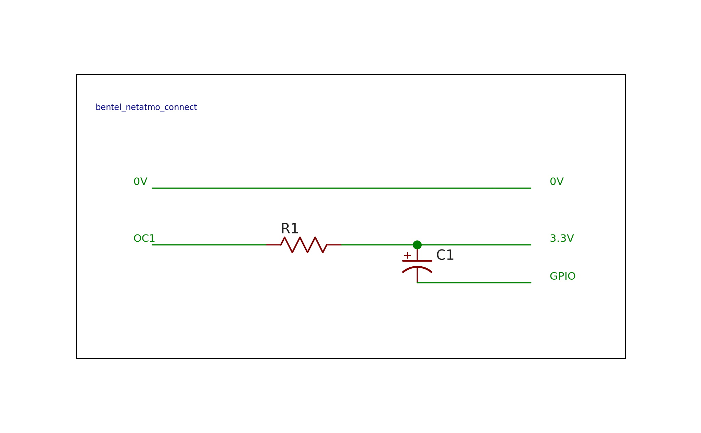

# Bentel Netatmo Connect
*Automation of Netatmo thermostat mode (away/schedule) based on a GPIO input of a Raspberry PI*
## Introduction
This project was born because the [Netatmo smart thermostat](https://www.netatmo.com/it-it/smart-thermostat) does not have any sort of geofencing functions in the mobile app and therefore you must remember to manually set the absent mode so as not to waste energy unnecessarily.

# How it works
The core is a python script inside a Raspberry PI that sets the away/schedule mode of the thermostat through the Netatmo API based on a GPIO input of the Raspberry PI.
I named this project *Bentel Netatmo connect* because i use an Open Collector output from the [Bentel Absoluta](https://www.bentelsecurity.com/index.php?n=products&o=view&id=388) home security system.
If GPIO is high the script set the thermostat mode to *schedule* or do nothing if the mode is *manual* (typically if you set a manual temperature before go home that is higher of the scheduled temperature); if GPIO is low the script set the thermostat mode to *away*.
A Telegram notification is also sent.

> [!NOTE]
> The OAuth2 tokens required by the Netatmo API, *access_token* and *refresh_token* are stored in a config file; other parameters are hard-coded into the script; customize them to your needs.

# Schematic (for Bentel Absoluta)

# Prerequisites

 - RPi.GPIO python library - `pip install RPi.GPIO`
 - Requests python library `pip install requests`
 - Requests OAuth2 python library `pip install requests-oauth2`
 - Telegram BOT for notifications - see [here](https://core.telegram.org/bots/tutorial)
 # Setup
 Create an app in [Netatmo developer console](https://dev.netatmo.com/).
